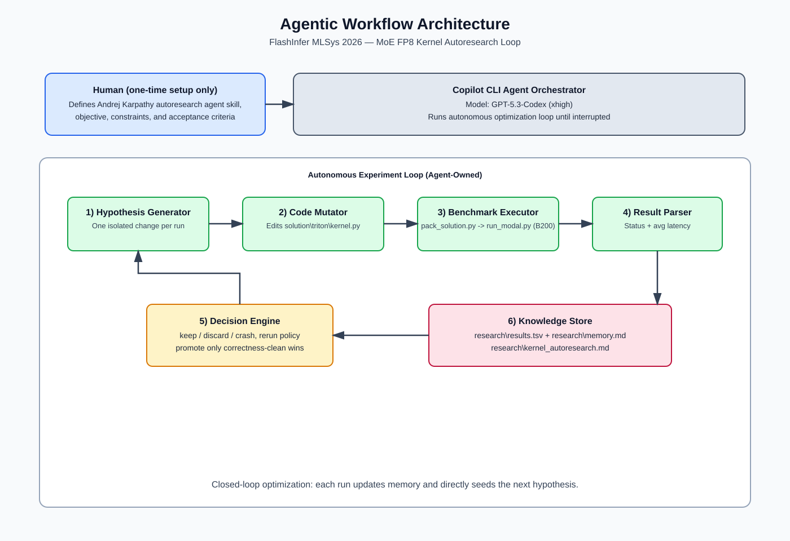

# FlashInfer AI Kernel Generation Contest @ MLSys 2026

<style>
@media print {
  @page { size: A4; margin: 11mm 11mm 12mm 11mm; }
  body { font-size: 11pt; line-height: 1.18; }
  p, li { margin-top: 0.18em; margin-bottom: 0.18em; }
  h1 { font-size: 20pt; margin-bottom: 0.25em; }
  h2 { font-size: 14pt; margin-top: 0.5em; margin-bottom: 0.2em; }
  h3 { font-size: 12pt; margin-top: 0.35em; margin-bottom: 0.15em; }
  ul, ol { margin-top: 0.2em; margin-bottom: 0.2em; }
  table { font-size: 11pt; margin-top: 0.25em; margin-bottom: 0.25em; }
  img { max-width: 560px; height: auto; }
}
</style>

- **Team name:** Insider
- **Teammate:** Mayank Suthar (Solo-team)
- **Email:** mayank992456@gmail.com

## 1) Submission context

- **Track:** `fused_moe` (`moe_fp8_block_scale_ds_routing_topk8_ng8_kg4_e32_h7168_i2048`)
- **Kernel implementation:** `solution\triton\kernel.py` (`run` entry point)
- **Benchmark target:** NVIDIA B200 via `scripts\run_modal.py`
- **Agent stack:** GitHub Copilot CLI agents, **GPT-5.3-Codex (xhigh)**, and Andrej Karpathy's **autoresearch** agent skill 
- **Method class:** Agent-Assisted, with an autoresearch-style autonomous experiment loop

## 2) End-to-end kernel working (full explanation)

### 2.1 Problem shape and fixed constants

In `run()`, the kernel is specialized for:
- `H=7168` (model hidden)
- `I=2048` (intermediate expert dimension)
- `E_global=256`, `E_local=32`
- `TOP_K=8`, `N_GROUP=8`, `TOPK_GROUP=4`
- block sizes: `BLOCK_M=16`, `BLOCK_K=128`, `BLOCK_I=128`, `BLOCK_N=128`

These choices define tile geometry and dispatch behavior across all routed workloads.

### 2.2 Stage A: compiled routing + dispatch (`_routing_and_dispatch`)

This stage converts routing logits into expert-token assignments and per-route weights:
1. Convert logits to FP32 and apply sigmoid.
2. Add routing bias.
3. Group experts (`N_GROUP=8`) and compute group scores from top-2 experts per group.
4. Keep top `TOPK_GROUP` groups per token.
5. Mask pruned experts and select final `TOP_K=8` experts per token.
6. Normalize selected routing weights with scaling.
7. Build dispatch order:
   - compute local expert ids
   - stable sort by local expert id
   - produce `sorted_tokens_all`, `sorted_weights_all`
8. Compute `expert_counts`, `expert_offsets`, and `block_offsets`.

This function is wrapped with:
`torch.compile(_routing_and_dispatch, mode="reduce-overhead")`
to reduce Python overhead and fuse routing-side ops into a lower-overhead execution path.

### 2.3 Stage B: GPU block map build (`_build_block_map_kernel`)

Given `block_offsets` and `expert_offsets`, this kernel builds three block metadata arrays:
- `b_expert_id`
- `b_token_offset`
- `b_num_tokens`

Each Triton program handles one output block id and:
1. finds owning expert (linear scan over `E_LOCAL=32`)
2. computes token offset for that block
3. computes valid token count (tail-aware, max `BLOCK_M`)

Why this matters: it avoids a multi-op CPU/PyTorch block-map pipeline and keeps mapping on device.

### 2.4 Stage C: GEMM1 + SwiGLU (`_moe_gemm1_swiglu_kernel`)

Grid: `(total_blocks, NUM_I_BLOCKS)` where:
- program axis 0 = routed block id
- program axis 1 = intermediate block index (`ib`)

For each routed block and each intermediate tile:
1. load token ids from `sorted_tokens`
2. gather FP8 hidden states + per-block hidden-state scales
3. load FP8 expert weights for W1 and W3 + scales
4. compute two FP32 dot products
5. apply dequant scaling (`sA * sW1`, `sA * sW3`)
6. apply SwiGLU (`silu(u2) * u1`)
7. store FP32 activations to `workspace[total_routed, I]`

This stage is compute-heavy and quantization-aware; FP32 accumulation is used for correctness stability.

### 2.5 Stage D: GEMM2 (`_moe_gemm2_kernel`)

Grid: `(NUM_H_BLOCKS * total_blocks,)` with grouped launch ordering.

Core mechanics:
1. map `pid` to `(block_id, nb)` using `GROUP_BLOCKS`
2. load routed tokens and route weights for that block
3. iterate `ib` over `NUM_I_BLOCKS`:
   - load FP32 workspace tile
   - load FP8 W2 tile + scale
   - dot in FP32 and apply W2 scale
4. multiply accumulated output by per-route weight
5. `tl.atomic_add` into global FP32 accumulator (`out_accum`)

Important correctness/performance controls:
- autotune configs over `(GROUP_BLOCKS, num_warps, num_stages)`
- autotune key `['TOTAL_BLOCKS', 'TOTAL_ROUTED']`
- `reset_to_zero=['out_ptr']` to keep atomic accumulation correct across autotune trials

### 2.6 Stage E: output finalize

`out_accum` is explicitly initialized with `torch.zeros((T,H), dtype=float32)` and copied to `output`.
The explicit zero init is required for correctness in this path.

## 3) Performance evolution and bottlenecks

From `research\results.tsv` and `research\kernel_autoresearch.md`:
- **Total logged experiments:** 299
- **Status split:** 17 keep / 235 discard / 46 crash
- **Best run:** `0.995000 ms` at commit `79897a020fd59648100377d9da4c41e7413f6f33`

Key milestones:

| Milestone | Avg latency (ms) | Effect |
|---|---:|---|
| Baseline (`0cc6daf`) | 1.524421 | Starting point |
| Grouped GEMM2 ordering (`bd4cfe7`) | 1.264368 | Large L2 locality gain |
| GEMM2 autotune + reset-to-zero (`53cce00`) | 1.088105 | Major step down |
| Add `TOTAL_ROUTED` key (`3f14870`) | 1.085474 | Better shape-aware config pick |
| Add `g4,w4,s3` config | 1.009474 | Near-threshold |
| Focused rerun (`79897a...`) | **0.995000** | Correctness-clean sub-1ms |

Dominant remaining issues:
- long-sequence workloads (`5e8dc11c`, `58a34f27`) remain the slowest
- heavy run-to-run variance near the 1ms boundary
- many low-precision or aggressive scheduling changes caused numerical failures

## 4) Andrej Karpathy's autoresearch agent skill adaptation for this project

We used Andrej Karpathy's autoresearch agent skill as the template for autonomous experiment design.

### 4.1 What we adopted from Andrej Karpathy's autoresearch agent skill

From the autoresearch README and `program.md` workflow pattern, we adopted:
- **single primary mutable code surface**
- **fixed, repeatable benchmark loop**
- **strict experiment ledger (`keep` / `discard` / `crash`)**
- **autonomous keep-or-revert discipline**
- **continuous agent loop behavior ("never stop" style until interrupted)**

### 4.2 Translation from autoresearch to kernel optimization

| Original autoresearch pattern | Our MoE kernel adaptation |
|---|---|
| Mutate `train.py` only | Mutate `solution\triton\kernel.py` (+ minimal config/log updates) |
| Run `uv run train.py` | Run pack + Modal benchmark pipeline |
| Optimize `val_bpb` | Optimize average latency (ms) under correctness |
| Track `results.tsv` with keep/discard/crash | Same structure in `research\results.tsv` |
| Use `program.md` as agent skill | Use autoresearch-style instructions + contest-specific constraints for agent actions |

### 4.3 Concrete auto-research loop used here

Per iteration:
1. Agent proposes one hypothesis.
2. Agent edits kernel code.
3. Agent packs solution:
   `conda run --no-capture-output -n fi-bench python scripts/pack_solution.py`
4. Agent benchmarks on B200:
   `conda run --no-capture-output -n fi-bench modal run scripts/run_modal.py > run.log 2>&1`
5. Agent parses benchmark outcomes from `run.log`.
6. Agent logs experiment in `research\results.tsv`.
7. Agent updates research memory (`research\memory.md`, `research\kernel_autoresearch.md`).
8. Agent decides keep/revert and immediately starts next trial.

## 5) Workflow architecture (proper agentic architecture)



This creates a closed autonomous optimization loop where evidence from each run directly drives the next code mutation.

## 6) Human vs agent responsibility (as requested)

For this submission, the practical split was:
- **Human:** implemented and provided the autoresearch skill-agent setup/instructions and constraints.
- **Agent:** executed the research campaign end-to-end (idea generation, code edits, benchmark execution, result parsing, logging, keep/revert decisions, and iterative optimization).

So after setup, experiment execution was agent-driven.

## 7) Tools and stack

- Triton + PyTorch for kernel implementation
- FlashInfer-Bench workflow for evaluation
- Modal for B200 benchmarking
- Andrej Karpathy's autoresearch agent skill methodology for autonomous research loop structure
- GitHub Copilot CLI agents powered by **GPT-5.3-Codex (xhigh)**

## 8) Reproducibility

From repo root:

```bash
conda run --no-capture-output -n fi-bench python scripts/pack_solution.py
conda run --no-capture-output -n fi-bench modal run scripts/run_modal.py > run.log 2>&1
```

Then append experiment metadata to `research\results.tsv`:
- commit or run id
- avg latency (ms)
- status (`keep`, `discard`, `crash`)
- concise description of attempted change

## 9) Final outcome

The autoresearch-driven agent workflow reached a correctness-clean **0.995000 ms** average latency run while preserving strict numerical constraints. The best path was centered on GEMM2 grouped scheduling and focused autotune-pool refinement, with long-sequence variance still the main remaining optimization frontier.


## 10) References

### 10.1 Internal project references

- `solution\triton\kernel.py`
- `research\results.tsv`
- `research\memory.md`
- `research\kernel_autoresearch.md`
- `scripts\pack_solution.py`
- `scripts\run_modal.py`
- `README.md`
- `autoresearch\README.md`
- `autoresearch\program.md`

### 10.2 External references used across the project

- Contest and benchmark stack:
  - http://mlsys26.flashinfer.ai/
  - https://github.com/flashinfer-ai/flashinfer-bench-starter-kit
  - https://github.com/flashinfer-ai/flashinfer
  - https://github.com/flashinfer-ai/flashinfer-bench
  - https://huggingface.co/datasets/flashinfer-ai/mlsys26-contest
  - https://bench.flashinfer.ai/docs/flashinfer-trace
  - https://www.nvidia.com
  - https://modal.com

- Triton/kernel optimization references:
  - https://triton-lang.org/main/getting-started/tutorials/03-matrix-multiplication.html
  - https://triton-lang.org/main/getting-started/tutorials/08-grouped-gemm.html
  - https://triton-lang.org/main/getting-started/tutorials/09-persistent-matmul.html
  - https://triton-lang.org/main/python-api/generated/triton.language.range.html
  - https://triton-lang.org/main/python-api/generated/triton.language.make_tensor_descriptor.html
  - https://triton-lang.org/main/python-api/generated/triton.language.load.html
  - https://triton-lang.org/main/python-api/generated/triton.language.store.html
  - https://raw.githubusercontent.com/triton-lang/triton/main/python/tutorials/11-programmatic-dependent-launch.py
  - https://raw.githubusercontent.com/triton-lang/triton/main/python/tutorials/gluon/04-tma.py
  - https://raw.githubusercontent.com/triton-lang/triton/main/python/tutorials/gluon/07-persistence.py
  - https://raw.githubusercontent.com/triton-lang/triton/main/python/tutorials/gluon/12-cluster-launch-control.py
  - https://developer.nvidia.com/cuda-gpus
  - https://www.nvidia.com/en-us/data-center/b200/
  - https://www.nvidia.com/en-us/data-center/gb200-nvl72/
  - https://arxiv.org/abs/2401.06066
  - https://arxiv.org/abs/2405.04434
  - https://arxiv.org/abs/2412.19437
  - https://pytorch.org/blog/training-moes/

- Autoresearch methodology references:
  - https://github.com/karpathy/autoresearch
  - https://docs.astral.sh/uv/
  - https://astral.sh/uv/install.sh
  - https://github.com/jsegov/autoresearch-win-rtx
